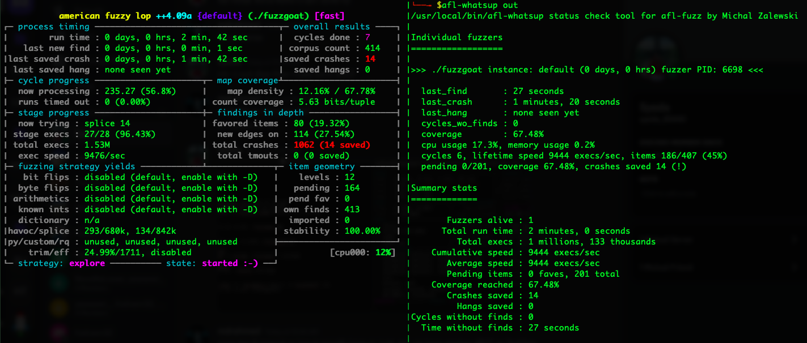
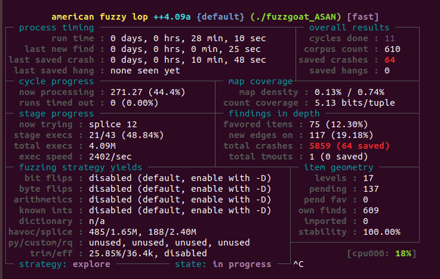
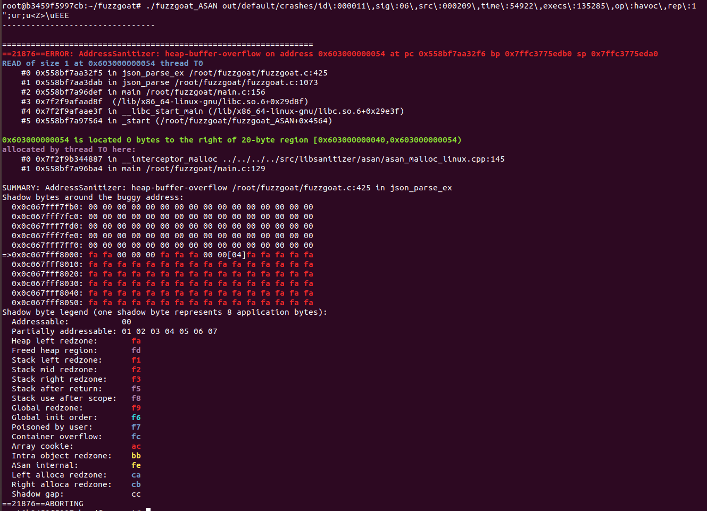
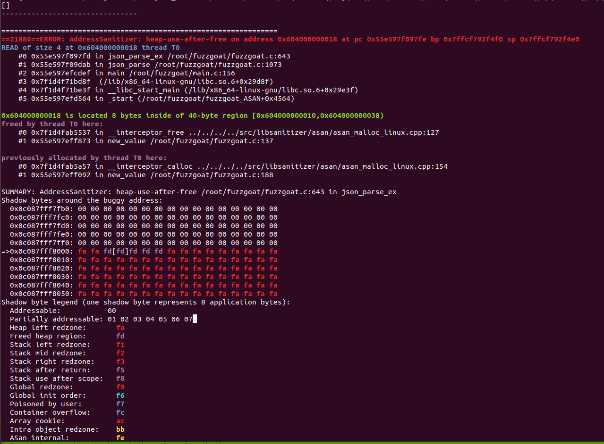
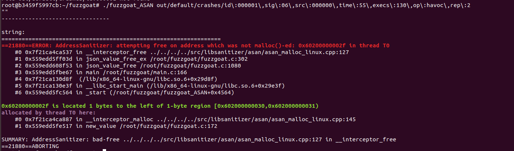

## Docker Image
Download the docker image, I have created for this homework.
```
# latest one
docker pull raihan019/ubuntu-aflplusplus:v0.1.2
```



### Using ASAN
The most common source of security vulnerabilities are memory corruption bugs e.g., buffer overflows, use-after-free errors, and memory leaks, etc. 



This is a heap-buffer-overflow error, which occurs when fuzzgoat tries to read or write beyond the boundaries of a dynamically allocated memory buffer. Specifically, the program attempted to read 1 byte at memory address 0x555d47e442f5, which is beyond the end of the allocated buffer. It also shows the error occurred at line 425 in the function json_parse_ex of the file. The memory region at address 0x555d47e37ba4 was allocated by a call to malloc in the main function at line 129. Also, it uses shadow bytes and shadow byte legend to track the state of memory regions surrounding the memory address involved in an error.



Similar to the previous error, this is a heap-use-after-free error. Similar to the previous detailed result, it shows the error originated in the json_parse_ex function at line 643 of the fuzzgoat.c file.



This error reported by AddressSanitizer (ASAN) is related to an attempt to free memory. The error occurred when the program attempted to free memory at the address 0x60200000002f. It also shows that the error occurred in the json_value_free_ex function at line 302 of the fuzzgoat.c file.




