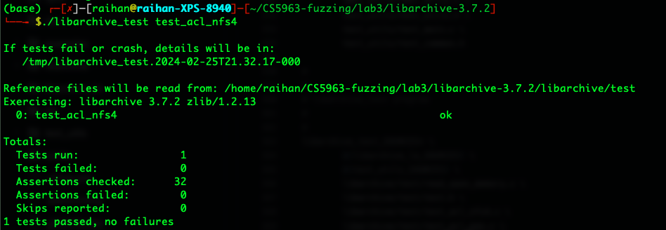
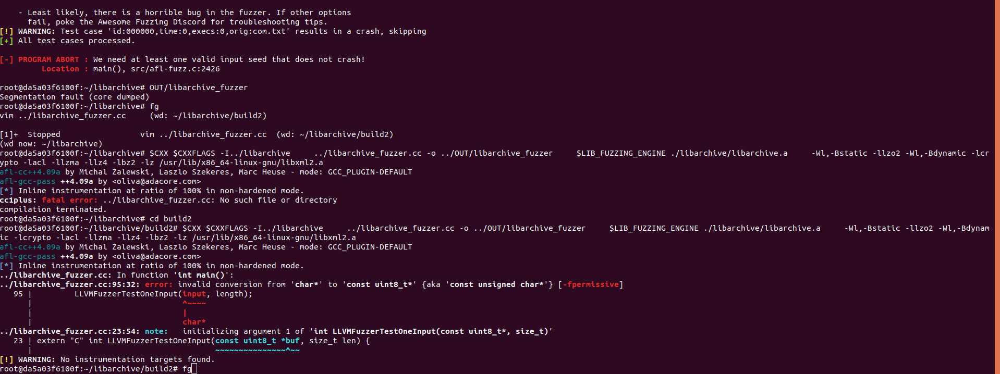

# Functions to fuzz
`pathcmp` is used by `bsdtar` to check the path.


## Install libarchive
### Install it from zip file
Download the file from the [libarchive site](https://www.libarchive.org/). I downloaded this [tar.gz](https://github.com/libarchive/libarchive/tarball/master)

Now, just execute following,
```
tar xzf libarchive-XX.YY.ZZ.tar.gz
cd libarchive-XX.YY.ZZ
./configure
make
make check
make install
```
### Install it from Source
Install the dependencies,
```
sudo apt update
sudo apt install libarchive-dev tar cpio unzip
sudo apt install libtool
```

You will need Autoconf version 2.71 or higher. So, check the version with this `autoconf --version`.
Clone the repo and follow along,
```
git clone git@github.com:libarchive/libarchive.git
build/autogen.sh
./configure
make
make check
make install
```

### Test libarchive
To test a program, we need to find all the test programs that has been used by the `libarchive_test`, 1 easy to to find all the tests instead of understanding `Makefile.am` is to run following to see the available tests,
```
./liarchive_test <random name>
# e.g.,
./libarchive_test test
```
Now, you can see the available test programs created as shown in the following picture,


Now, we can run a test program like following,
```
./libarchive_test test_acl_nfs4
```


**If we want to fuzz this program then we can't put these test commands in a file and just fuzz it. Because these test programs is just a command, if we provide these as inputs then it will just create a variation of these commands. So, we need a harness file to fuzz it.**

## Instrument with afl++
Compile again to instrument the codes,
```
export CC='afl-cc' 
export CXX='afl-cc++'

# or,
export CC='afl-clang-fast'
export CXX='afl-clang-fast++'

./configure
make
make check
# do not make install, these binaries are instrumented
```

After running make,


It is creating the zip & tar files for testing,


## Fuzz
### Fuzz `libarchive_test`
#### Test using `libarchive_fuzzer.cc` of `oss-fuzz` 
Using the `build.sh` to build the harness `libarchive_fuzzer`. [Here is the details](https://github.com/google/oss-fuzz/tree/a40cd76e1469f5fd5337924ba1247607d5e6b80f/projects/libarchive)

```
sudo apt-get install zip sharutils
sudo apt-get install liblzo2-dev
sudo apt-get install libssl-dev  # For OpenSSL
sudo apt-get install libacl1-dev
sudo apt-get install liblz4-dev
sudo apt-get install libbz2-dev
sudo apt-get install liblzma-dev
```
or, just run this `sudo apt-get install liblzo2-dev libssl-dev libacl1-dev liblz4-dev libbz2-dev sharutils liblzma-dev`
```
echo '$(CC) $(DEFS) $(DEFAULT_INCLUDES) $(INCLUDES) $(libarchive_test_CPPFLAGS) $(CPPFLAGS) $(AM_CFLAGS) $(CFLAGS) -MT libarchive/test-archive_write.o -MD -MP -MF libarchive/$(DEPDIR)/test-archive_write.Tpo -c -o libarchive/test-archive_write.o `test -f 'libarchive/archive_write.c' || echo '$(srcdir)/'`libarchive/archive_write.c'
```

And do following to set the environment,
```
cd libarchive-3.7.2
export SRC='.'
mkdir OUT
export OUT='OUT'

# copy the libarchive_fuzzer.cc and build.sh from the oss-fuzz repo
```

Now, just run following,
```
sh build.sh
```

To clean everything, do this, `rm -r build2/ OUT/ uudecode/ pocs/`

Now, fuzz it like following,
```
afl-fuzz -i in/ -D -o out/ OUT/libarchive_fuzzer @@
```

I got the following which is asking for 1 valid input is because I didn't provide a valid input, 


Now, I called the harness program from `main` like following,
```
#define SIZE 1000

int main(){
	const uint8_t input[SIZE] = {0};
	ssize_t length;
	length = read(STDIN_FILENO, (char*)input, SIZE);

	LLVMFuzzerTestOneInput(input, length);	
}
```

Now, when I fuzzed it again then it worked fine and got the absolute coverage.

### Fuzz `bsdtar`
Now, to fuzz it,
```
# download a tar file and put it to ./in folder
wget https://github.com/mdrahmed/dataVisProject/archive/refs/tags/v1.0.tar.gz
wget https://www.libarchive.org/downloads/libarchive-3.7.2.tar.gz
# create tar files
tar -cvf pdfs.tar.gz pdf_examples/

# Now, check if bsdtar is working or not
./bsdtar -tf ./in/<tar file>
# ./bsdtar -tf in/libarchive-3.7.2.tar.gz 

afl-fuzz -i in/ -D -o out -- ./bsdtar -tf @@
```

This is not the actual input file, need to generate the actual input file,


