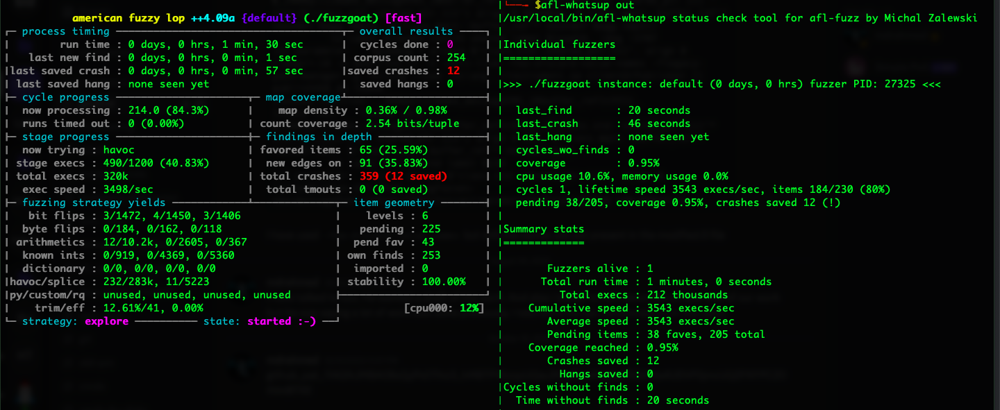
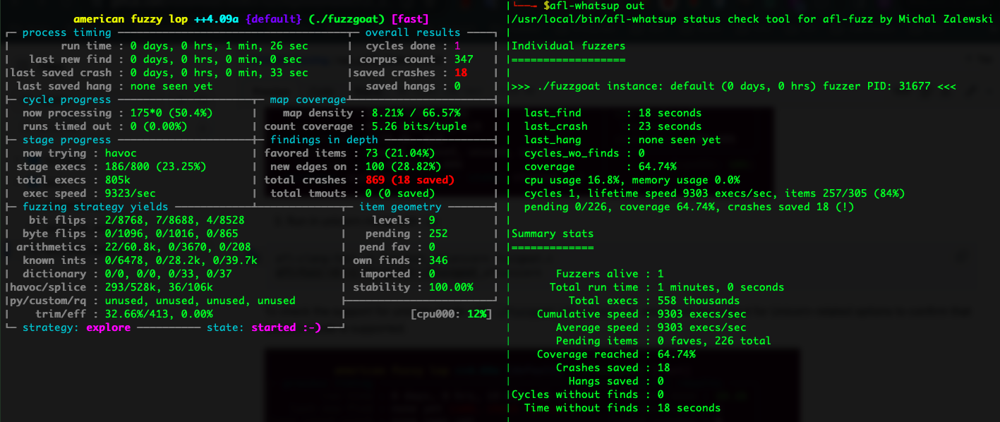
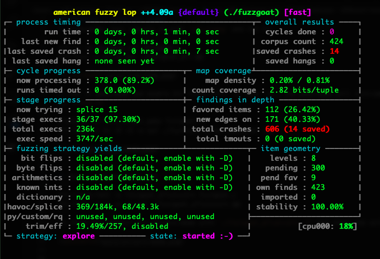

## Features - different modes
Check `afl-fuzz -h` for details.
1. llvm-mode: just compile it with `afl-clang` and run it.
```
afl-cc -o fuzzgoat_afl fuzzgoat.c
afl-fuzz -i in -o out ./fuzzgoat_afl @@
```


2. Run in Qemu-mode and enable bit flips with `-Q` and `-D`. The qemu-mode will instrument at runtime, so, it should be compiled with general compilers like `gcc` or `clang-14`
```
clang-14 -o fuzz_target_qemu fuzzgoat.c
afl-fuzz -i in -D -Q -o out ./fuzz_target_qemu  @@
```



3. Run in unicorn-mode with `-U`
```
afl-clang-fast -o fuzzgoat_aflunicorn fuzzgoat.c
afl-fuzz -U -i in -o out ./fuzzgoat_aflunicorn @@
```
To check the support for unicorn-mode with `./fuzzgoat_aflunicorn -h` and check the output for Unicorn-related options to confirm that Unicorn mode is supported.




4. Frida-mode: 
```
clang-14 -o fuzz_target_frida fuzzgoat.c
afl-fuzz -i in -O -o out -- ./fuzz_target_frida @@
```


5. nyx-mode: install nyx first
```
afl-clang-fast -o fuzz_target_nyx fuzzgoat.c
afl-fuzz -Y -i in -o out -- ./fuzz_target_nyx @@
```

In terms of speed and code coverage, `llvm` and `unicorn` are better. 
`Qemu-mode` is slow but it can instrument the executable, so, it would be useful when we don't have the source code.

